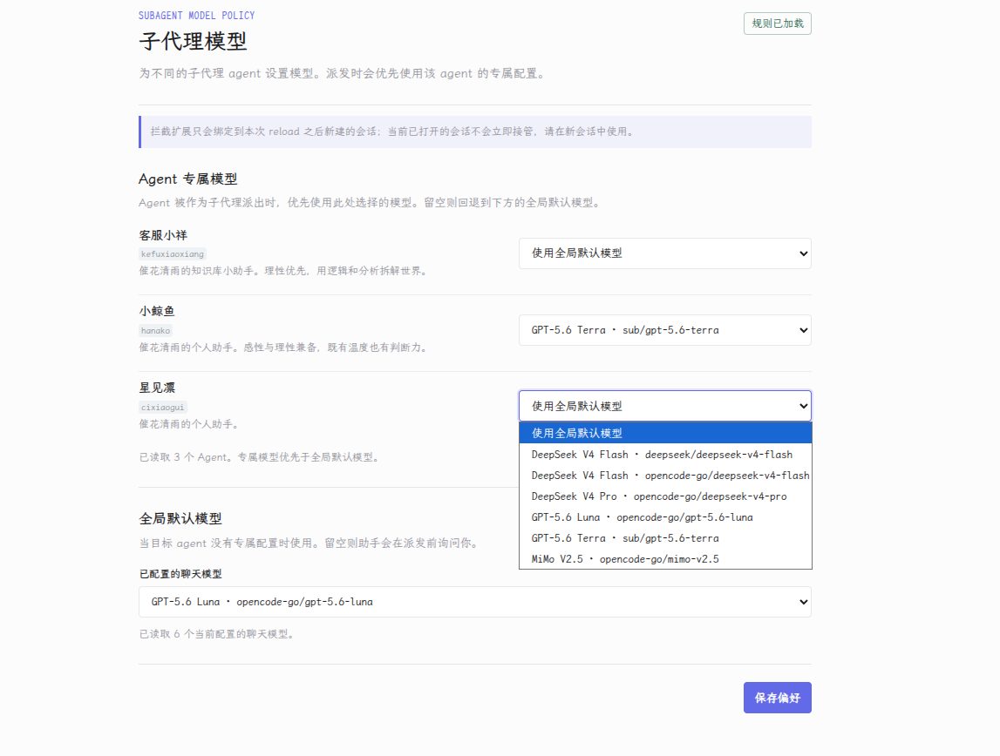

# 子代理模型选择

一个 HanaAgent 全权插件。它会在内置 `subagent` 工具执行前检查模型参数：没有显式 `provider/id` 的派发会被拦截。配套 skill 会先读取模型策略，再带着准确模型派出子代理。

> 偏好页会自动列出已配置的 Agent；每个 Agent 可选择自己的子代理模型，并在未单独配置时回退到全局默认模型。

## 能做什么

- 每次派发子代理前，要求一个显式模型，避免静默使用宿主默认值。
- 「子代理模型」页面自动读取 Hana 当前可用的 Agent 与已配置聊天模型。
- 可为每个目标 Agent 单独设置子代理模型。例如让 `cixiaogui` 总是用深度模型、让 `kefuxiaoxiang` 使用速度更快的模型。
- 没有专属配置的目标 Agent 使用全局默认模型；全局默认也为空时，助手会询问用户。
- 用户在当前请求中明确指定的模型始终优先于 Agent 专属模型和全局默认模型。

## 安装

1. 在本仓库的 GitHub Release 页面下载 `subagent-model-picker-0.3.0.zip`。
2. 打开 Hana 的设置 → 插件，选择安装本地插件，并选择该 zip 文件。
3. 允许这个插件使用 `full-access`，然后重新加载插件。
4. 新建一个会话后再派发子代理，使拦截规则绑定到新会话。

## 使用方式

1. 打开侧栏的「子代理模型」页面。
2. 在“Agent 专属模型”中，为需要单独设置的 Agent 选择模型。
3. 可选地在“全局默认模型”中设置未单独配置 Agent 的兜底模型。
4. 正常和助手聊天即可。例如：`让 cixiaogui 派一个子代理审一下这个项目。`

## 选择优先级

1. 用户在当前消息中明确指定的 `provider/id`
2. 目标 Agent 的专属模型偏好
3. 全局默认模型
4. 询问用户

## 重要限制

- Agent 列表来自稳定的 `agent:list` 能力，聊天模型候选来自稳定的 `provider:models-by-type`（`type: "chat"`）能力。
- 这两个目录代表当前 Hana 配置。实际派发时，Hana 仍会最终确认目标模型能否执行。
- `subagent_reply` 没有模型覆盖参数。这个插件强制的是新建子代理时的模型选择，不能在续接已存在的子代理时切换模型。
- `extensions/` 使用 Pi SDK 的 `tool_call` 拦截能力，因此必须保持 `trust: full-access`。插件禁用后，拦截随之失效。

## 开发安装

1. Hana 设置 → 插件，开启「允许 Agent 插件开发工具」。
2. 将此目录安装为开发插件。
3. 重新加载插件后，extension 只会绑定到之后新建的会话；已打开的会话不会立即接管。偏好页显示“规则已加载”只表示插件已启用，不表示当前会话已绑定拦截器。

源码不修改 Hana 的 `core/`、`lib/` 或 `desktop/`，因此 Hana 更新不会覆盖该插件。
